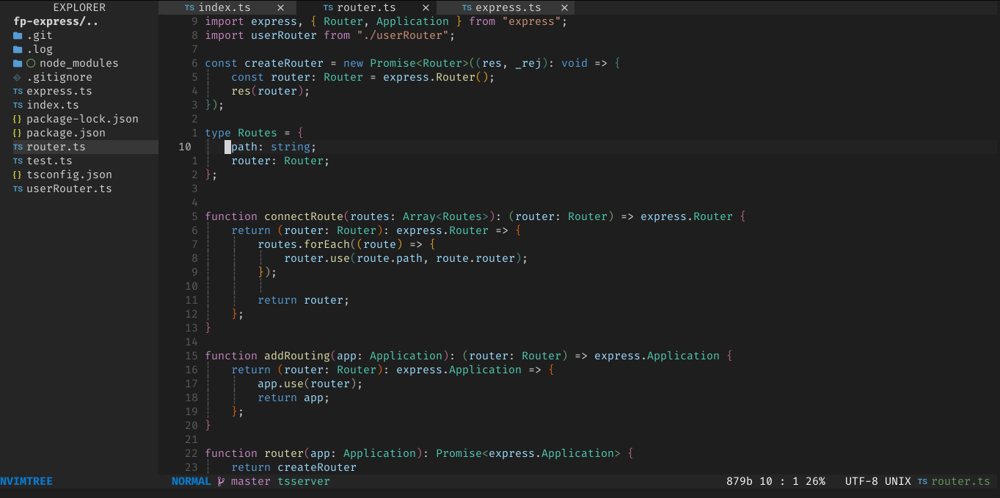
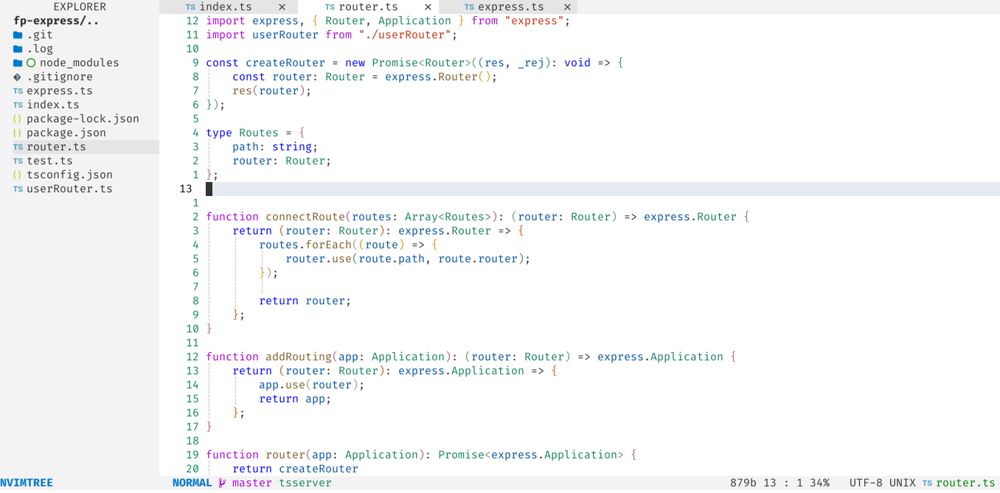

<h1 align="center">vscode.nvim</h1>

vscode.nvim (formerly `codedark.nvim`) is a Lua port of [vim-code-dark](https://github.com/tomasiser/vim-code-dark) colorscheme for [neovim](https://github.com/neovim/neovim) with VScode's light and dark theme

## Dark



## Light



## Supported Plugins

- [BarBar](https://github.com/romgrk/barbar.nvim)
- [BufferLine](https://github.com/akinsho/nvim-bufferline.lua)
- [Git Gutter](https://github.com/airblade/vim-gitgutter)
- [Git Signs](https://github.com/lewis6991/gitsigns.nvim)
- [Indent Blankline](https://github.com/lukas-reineke/indent-blankline.nvim)
- [LSP](https://github.com/neovim/nvim-lspconfig)
- [Lualine](https://github.com/hoob3rt/lualine.nvim)
- [NvimTree](https://github.com/kyazdani42/nvim-tree.lua)
- [Telescope](https://github.com/nvim-telescope/telescope.nvim)
- [Treesitter](https://github.com/nvim-treesitter/nvim-treesitter)
- [nvim-cmp](https://github.com/hrsh7th/nvim-cmp)
- [nvim-compe](https://github.com/hrsh7th/nvim-compe)

## ⬇️ Installation

Install via package manager

```lua
-- Packer:
use 'VSNeoVim/Darkup.nvim'
```

## 🚀 Usage

```lua
-- Lua:
-- For dark theme
vim.g.Darkup_style = "dark"
-- For light theme
vim.g.Darkup_style = "light"
-- Enable transparent background
vim.g.Darkup_transparent = 1
-- Enable italic comment
vim.g.Darkup_italic_comment = 1
-- Disable nvim-tree background color
vim.g.Darkup_disable_nvimtree_bg = true
vim.cmd([[colorscheme Darkup]])
```

If you are using [`lualine`](https://github.com/hoob3rt/lualine.nvim), you can also enable the provided theme:

```lua
require("lualine").setup({
    options = {
        -- ...
        theme = "vscode",
        -- ...
    },
})
```

[nvim-bufferline.lua](https://github.com/akinsho/nvim-bufferline.lua)  setup for exact match as screenshots

## Switching theme

```
:lua require('vscode').change_style("light")
:lua require('vscode').change_style("dark")
```
